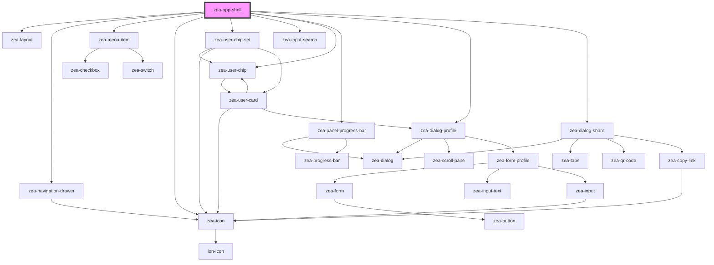

# zea-app-shell

<!-- Auto Generated Below -->

## Properties

| Property                | Attribute                 | Description | Type     | Default                                                     |
| ----------------------- | ------------------------- | ----------- | -------- | ----------------------------------------------------------- |
| `centerProgressBar`     | `center-progress-bar`     |             | `any`    | `undefined`                                                 |
| `centerProgressMessage` | `center-progress-message` |             | `string` | `''`                                                        |
| `leftPanelWidth`        | `left-panel-width`        |             | `string` | `'200'`                                                     |
| `leftProgressBar`       | `left-progress-bar`       |             | `any`    | `undefined`                                                 |
| `leftProgressMessage`   | `left-progress-message`   |             | `string` | `''`                                                        |
| `logoUrl`               | `logo-url`                |             | `string` | `'https://storage.googleapis.com/misc-assets/zea-logo.png'` |
| `rightPanelWidth`       | `right-panel-width`       |             | `string` | `'200'`                                                     |
| `rightProgressBar`      | `right-progress-bar`      |             | `any`    | `undefined`                                                 |
| `rightProgressMessage`  | `right-progress-message`  |             | `string` | `''`                                                        |
| `session`               | `session`                 |             | `any`    | `{}`                                                        |
| `userData`              | `user-data`               |             | `any`    | `{}`                                                        |

## Events

| Event               | Description | Type               |
| ------------------- | ----------- | ------------------ |
| `userAuthenticated` |             | `CustomEvent<any>` |

## Dependencies

### Depends on

- [zea-layout](../zea-layout)
- [zea-navigation-drawer](../zea-navigation-drawer)
- [zea-menu-item](../zea-menu-item)
- [zea-icon](../zea-icon)
- [zea-user-chip-set](../zea-user-chip-set)
- [zea-input-search](../zea-input-search)
- [zea-user-chip](../zea-user-chip)
- [zea-panel-progress-bar](../zea-panel-progress-bar)
- [zea-dialog-profile](../zea-dialog-profile)
- [zea-dialog-share](../zea-dialog-share)

### Graph

----------------------------------------------

*Built with [StencilJS](https://stenciljs.com/)*
