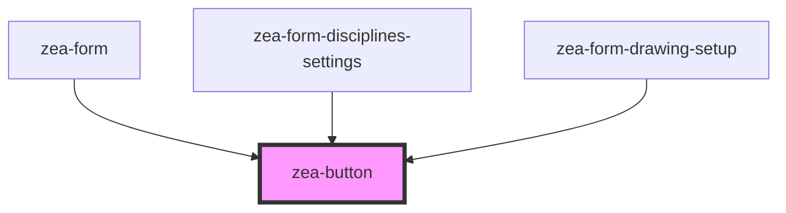

# zea-button

<!-- Auto Generated Below -->

## Properties

| Property      | Attribute      | Description                                                 | Type      | Default     |
| ------------- | -------------- | ----------------------------------------------------------- | --------- | ----------- |
| `color`       | `color`        | Whether the button should be disabled (true) or not (false) | `boolean` | `false`     |
| `density`     | `density`      | Whether the button should be disabled (true) or not (false) | `string`  | `'normal'`  |
| `disabled`    | `disabled`     | Whether the button should be disabled (true) or not (false) | `boolean` | `false`     |
| `htmlContent` | `html-content` | Text/html to be displayed inside the button                 | `string`  | `undefined` |
| `variant`     | `variant`      | Style variant for the button                                | `string`  | `'solid'`   |

## Dependencies

### Used by

 - [zea-form](../zea-form)
 - [zea-form-disciplines-settings](../zea-form-disciplines-settings)
 - [zea-form-drawing-setup](../zea-form-drawing-setup)

### Graph

----------------------------------------------

*Built with [StencilJS](https://stenciljs.com/)*
