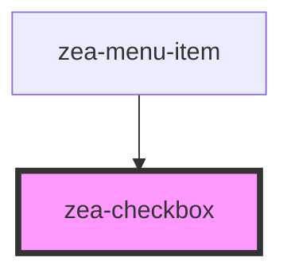

# zea-checkbox

<!-- Auto Generated Below -->

## Properties

| Property   | Attribute  | Description                                        | Type      | Default     |
| ---------- | ---------- | -------------------------------------------------- | --------- | ----------- |
| `checked`  | `checked`  | /**    Whether the checkbox is checked             | `boolean` | `false`     |
| `disabled` | `disabled` | /**    Whether the checkbox is disabled            | `boolean` | `false`     |
| `name`     | `name`     | /**    Text/html to be displayed inside the button | `string`  | `undefined` |

## Dependencies

### Used by

 - [zea-menu-item](../zea-menu-item)

### Graph

----------------------------------------------

*Built with [StencilJS](https://stenciljs.com/)*
