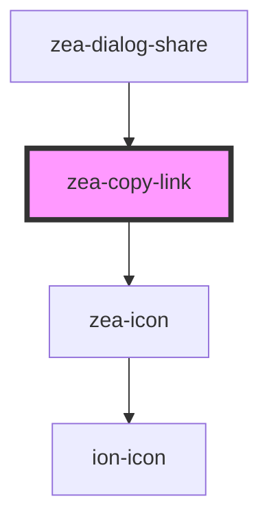

# zea-copy-link

<!-- Auto Generated Below -->

## Properties

| Property           | Attribute            | Description | Type      | Default       |
| ------------------ | -------------------- | ----------- | --------- | ------------- |
| `link`             | `link`               |             | `string`  | `''`          |
| `tooltipIsVisible` | `tooltip-is-visible` |             | `boolean` | `false`       |
| `tooltipText`      | `tooltip-text`       |             | `string`  | `'Copy Link'` |

## Dependencies

### Used by

 - [zea-dialog-share](../zea-dialog-share)

### Depends on

- [zea-icon](../zea-icon)

### Graph

----------------------------------------------

*Built with [StencilJS](https://stenciljs.com/)*
