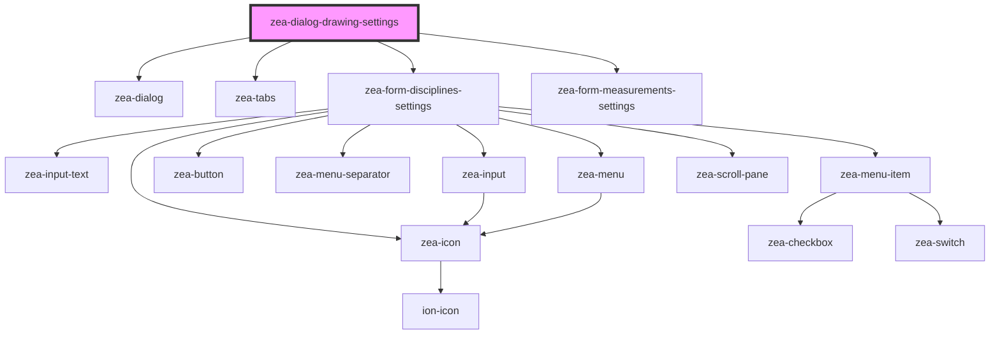

# zea-dialog-drawing-settings

<!-- Auto Generated Below -->

## Properties

| Property     | Attribute     | Description | Type      | Default     |
| ------------ | ------------- | ----------- | --------- | ----------- |
| `allowClose` | `allow-close` |             | `boolean` | `true`      |
| `showLabels` | `show-labels` |             | `boolean` | `true`      |
| `shown`      | `shown`       |             | `boolean` | `false`     |
| `userData`   | `user-data`   |             | `any`     | `undefined` |

## Dependencies

### Depends on

- [zea-dialog](../zea-dialog)
- [zea-tabs](../zea-tabs)
- [zea-form-disciplines-settings](../zea-form-disciplines-settings)
- [zea-form-measurements-settings](../zea-form-measurements-settings)

### Graph

----------------------------------------------

*Built with [StencilJS](https://stenciljs.com/)*
