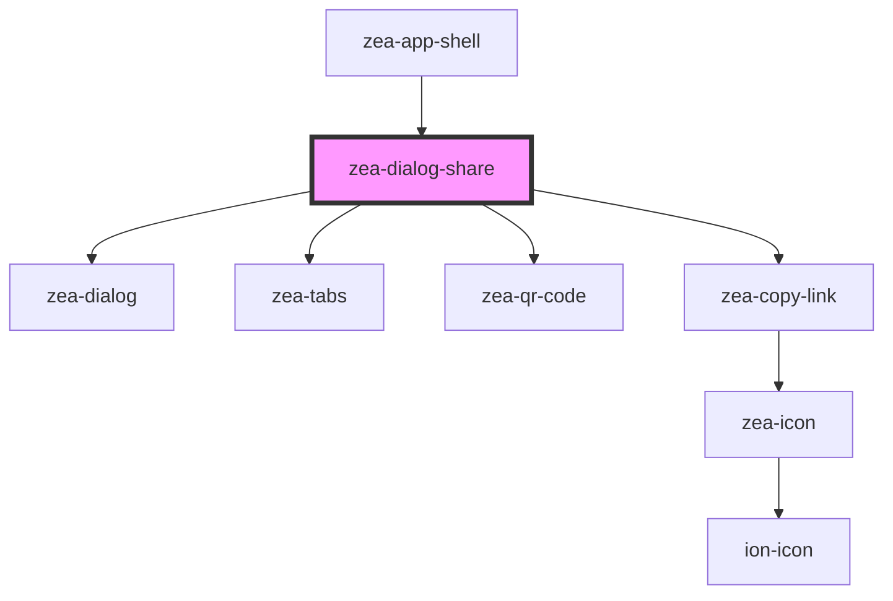

# zea-dialog-share

<!-- Auto Generated Below -->

## Properties

| Property | Attribute | Description | Type      | Default |
| -------- | --------- | ----------- | --------- | ------- |
| `shown`  | `shown`   |             | `boolean` | `false` |

## Dependencies

### Used by

 - [zea-app-shell](../zea-app-shell)

### Depends on

- [zea-dialog](../zea-dialog)
- [zea-tabs](../zea-tabs)
- [zea-qr-code](../zea-qr-code)
- [zea-copy-link](../zea-copy-link)

### Graph

----------------------------------------------

*Built with [StencilJS](https://stenciljs.com/)*
