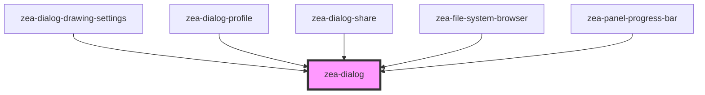

# zea-dialog

<!-- Auto Generated Below -->

## Properties

| Property       | Attribute       | Description | Type      | Default  |
| -------------- | --------------- | ----------- | --------- | -------- |
| `addPadding`   | `add-padding`   |             | `boolean` | `true`   |
| `allowClose`   | `allow-close`   |             | `boolean` | `true`   |
| `showBackdrop` | `show-backdrop` |             | `boolean` | `true`   |
| `shown`        | `shown`         |             | `boolean` | `false`  |
| `width`        | `width`         |             | `string`  | `'auto'` |

## Events

| Event         | Description | Type               |
| ------------- | ----------- | ------------------ |
| `dialogClose` |             | `CustomEvent<any>` |

## Methods

### `prompt() => Promise<void>`

#### Returns

Type: `Promise<void>`

## Dependencies

### Used by

 - [zea-dialog-drawing-settings](../zea-dialog-drawing-settings)
 - [zea-dialog-profile](../zea-dialog-profile)
 - [zea-dialog-share](../zea-dialog-share)
 - [zea-file-system-browser](../zea-file-system-browser)
 - [zea-panel-progress-bar](../zea-panel-progress-bar)

### Graph

----------------------------------------------

*Built with [StencilJS](https://stenciljs.com/)*
