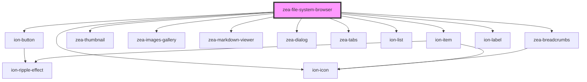

# zea-file-system-browser

<!-- Auto Generated Below -->

## Properties

| Property   | Attribute   | Description                                     | Type     | Default     |
| ---------- | ----------- | ----------------------------------------------- | -------- | ----------- |
| `filter`   | `filter`    | Display only FS Objects that match this filter. | `string` | `''`        |
| `folderId` | `folder-id` | Folder Id inside project.                       | `string` | `undefined` |
| `project`  | `project`   | Zea project.                                    | `any`    | `undefined` |

## Events

| Event          | Description | Type               |
| -------------- | ----------- | ------------------ |
| `changeFolder` |             | `CustomEvent<any>` |

## Dependencies

### Depends on

- ion-button
- ion-icon
- [zea-breadcrumbs](../zea-breadcrumbs)
- [zea-thumbnail](../zea-thumbnail)
- [zea-images-gallery](../zea-images-gallery)
- [zea-markdown-viewer](../zea-markdown-viewer)
- [zea-dialog](../zea-dialog)
- [zea-tabs](../zea-tabs)
- ion-list
- ion-item
- ion-label

### Graph

----------------------------------------------

*Built with [StencilJS](https://stenciljs.com/)*
