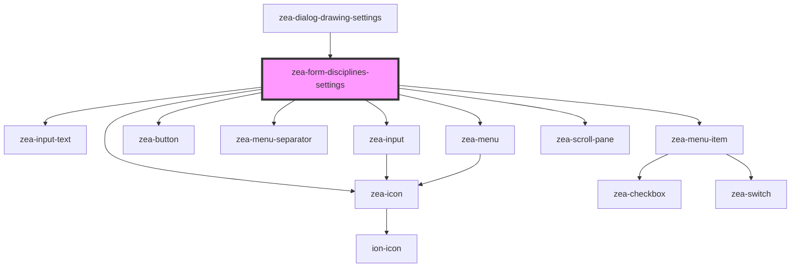

# zea-form-disciplines-settings

<!-- Auto Generated Below -->

## Properties

| Property      | Attribute     | Description | Type     | Default  |
| ------------- | ------------- | ----------- | -------- | -------- |
| `contentId`   | `content-id`  |             | `string` | `'none'` |
| `disciplines` | `disciplines` |             | `any`    | `[]`     |

## Events

| Event          | Description | Type               |
| -------------- | ----------- | ------------------ |
| `dialogResize` |             | `CustomEvent<any>` |

## Dependencies

### Used by

 - [zea-dialog-drawing-settings](../zea-dialog-drawing-settings)

### Depends on

- [zea-input-text](../zea-input-text)
- [zea-input](../zea-input)
- [zea-button](../zea-button)
- [zea-menu-separator](../zea-menu-separator)
- [zea-menu](../zea-menu)
- [zea-menu-item](../zea-menu-item)
- [zea-icon](../zea-icon)
- [zea-scroll-pane](../zea-scroll-pane)

### Graph

----------------------------------------------

*Built with [StencilJS](https://stenciljs.com/)*
