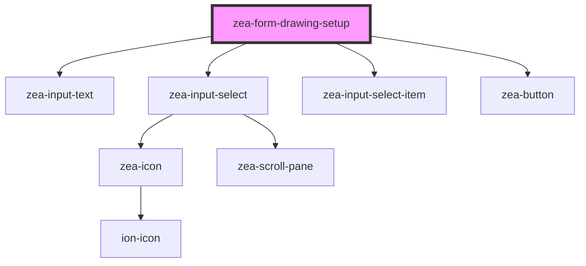

# zea-form-drawing-setup

<!-- Auto Generated Below -->

## Properties

| Property      | Attribute | Description | Type    | Default |
| ------------- | --------- | ----------- | ------- | ------- |
| `disciplines` | --        |             | `any[]` | `[]`    |
| `scales`      | --        |             | `any[]` | `[]`    |

## Dependencies

### Depends on

- [zea-input-text](../zea-input-text)
- [zea-input-select](../zea-input-select)
- [zea-input-select-item](../zea-input-select-item)
- [zea-button](../zea-button)

### Graph

----------------------------------------------

*Built with [StencilJS](https://stenciljs.com/)*
