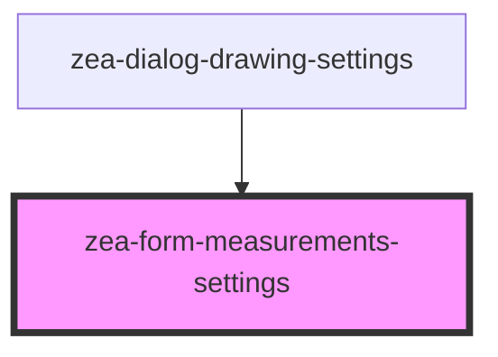

# zea-form-measurements-settings

<!-- Auto Generated Below -->

## Properties

| Property | Attribute | Description  | Type     | Default         |
| -------- | --------- | ------------ | -------- | --------------- |
| `test`   | `test`    | A test prop. | `string` | `'Hello World'` |

## Dependencies

### Used by

 - [zea-dialog-drawing-settings](../zea-dialog-drawing-settings)

### Graph

----------------------------------------------

*Built with [StencilJS](https://stenciljs.com/)*
