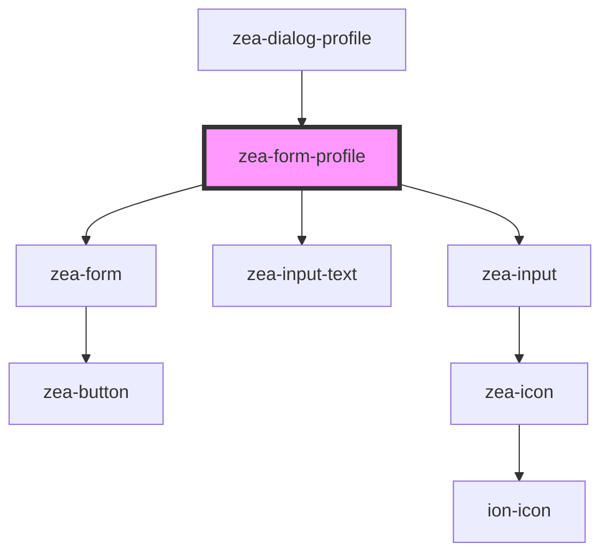

# zea-form-profile

<!-- Auto Generated Below -->

## Properties

| Property           | Attribute            | Description  | Type      | Default                                                                                          |
| ------------------ | -------------------- | ------------ | --------- | ------------------------------------------------------------------------------------------------ |
| `showLabels`       | `show-labels`        |              | `boolean` | `true`                                                                                           |
| `submitButtonText` | `submit-button-text` | A test prop. | `string`  | `'SAVE'`                                                                                         |
| `userData`         | `user-data`          |              | `any`     | `{}`                                                                                             |
| `welcomeHtml`      | `welcome-html`       | A test prop. | `string`  | ``Welcome to Zea Construction. We just need  a few details and   then you're ready to go.`` |

## Events

| Event            | Description | Type               |
| ---------------- | ----------- | ------------------ |
| `userRegistered` |             | `CustomEvent<any>` |

## Dependencies

### Used by

 - [zea-dialog-profile](../zea-dialog-profile)

### Depends on

- [zea-form](../zea-form)
- [zea-input-text](../zea-input-text)
- [zea-input](../zea-input)

### Graph

----------------------------------------------

*Built with [StencilJS](https://stenciljs.com/)*
