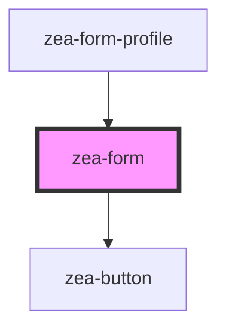

# zea-form

<!-- Auto Generated Below -->

## Properties

| Property         | Attribute         | Description | Type      | Default     |
| ---------------- | ----------------- | ----------- | --------- | ----------- |
| `formValue`      | `form-value`      |             | `any`     | `{}`        |
| `isValid`        | `is-valid`        |             | `boolean` | `true`      |
| `submitCallback` | `submit-callback` |             | `any`     | `undefined` |
| `submitText`     | `submit-text`     |             | `string`  | `'SUBMIT'`  |
| `validate`       | `validate`        |             | `boolean` | `true`      |

## Dependencies

### Used by

 - [zea-form-profile](../zea-form-profile)

### Depends on

- [zea-button](../zea-button)

### Graph

----------------------------------------------

*Built with [StencilJS](https://stenciljs.com/)*
