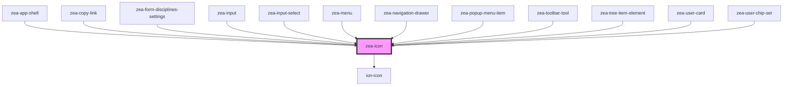

# zea-icon

<!-- Auto Generated Below -->

## Properties

| Property | Attribute | Description                              | Type     | Default     |
| -------- | --------- | ---------------------------------------- | -------- | ----------- |
| `name`   | `name`    | The icon name within the choosen library | `string` | `undefined` |
| `size`   | `size`    | The icon size in pixels                  | `number` | `24`        |
| `type`   | `type`    | The library to load the icon from        | `string` | `'ionic'`   |

## Dependencies

### Used by

 - [zea-app-shell](../zea-app-shell)
 - [zea-copy-link](../zea-copy-link)
 - [zea-form-disciplines-settings](../zea-form-disciplines-settings)
 - [zea-input](../zea-input)
 - [zea-input-select](../zea-input-select)
 - [zea-menu](../zea-menu)
 - [zea-navigation-drawer](../zea-navigation-drawer)
 - [zea-popup-menu-item](../zea-popup-menu-item)
 - [zea-toolbar-tool](../zea-toolbar-tool)
 - [zea-tree-item-element](../zea-tree-item-element)
 - [zea-user-card](../zea-user-card)
 - [zea-user-chip-set](../zea-user-chip-set)

### Depends on

- ion-icon

### Graph

----------------------------------------------

*Built with [StencilJS](https://stenciljs.com/)*
