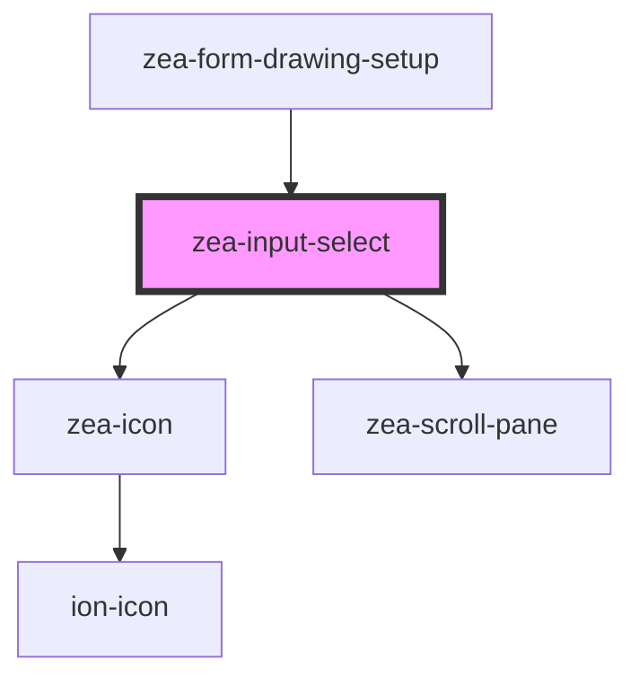

# zea-input-select

<!-- Auto Generated Below -->

## Properties

| Property              | Attribute               | Description | Type      | Default           |
| --------------------- | ----------------------- | ----------- | --------- | ----------------- |
| `autoValidate`        | `auto-validate`         |             | `boolean` | `false`           |
| `invalidMessage`      | `invalid-message`       |             | `string`  | `'Not valid'`     |
| `invalidMessageShown` | `invalid-message-shown` |             | `boolean` | `false`           |
| `isValid`             | `is-valid`              |             | `boolean` | `true`            |
| `label`               | `label`                 |             | `string`  | `'Enter text...'` |
| `name`                | `name`                  |             | `string`  | `'zea-input'`     |
| `optionsShown`        | `options-shown`         |             | `boolean` | `false`           |
| `required`            | `required`              |             | `boolean` | `false`           |
| `selectCallback`      | `select-callback`       |             | `any`     | `undefined`       |
| `showLabel`           | `show-label`            |             | `boolean` | `true`            |
| `value`               | `value`                 |             | `any`     | `undefined`       |

## Dependencies

### Used by

 - [zea-form-drawing-setup](../zea-form-drawing-setup)

### Depends on

- [zea-icon](../zea-icon)
- [zea-scroll-pane](../zea-scroll-pane)

### Graph

----------------------------------------------

*Built with [StencilJS](https://stenciljs.com/)*
