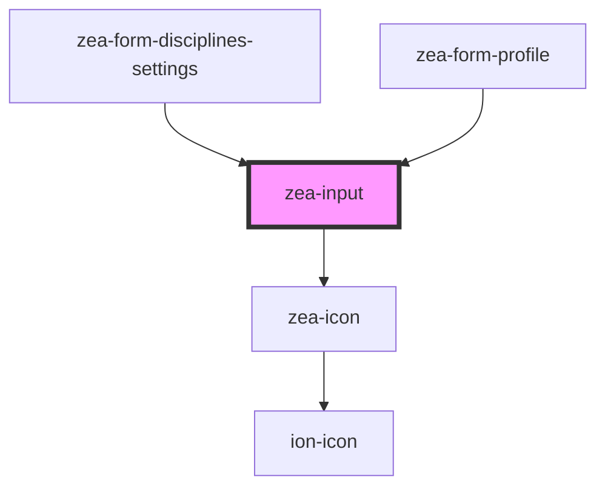

# zea-input

<!-- Auto Generated Below -->

## Properties

| Property              | Attribute               | Description | Type       | Default                                                                                                                                                                                                                                                                                                             |
| --------------------- | ----------------------- | ----------- | ---------- | ------------------------------------------------------------------------------------------------------------------------------------------------------------------------------------------------------------------------------------------------------------------------------------------------------------------- |
| `autoValidate`        | `auto-validate`         |             | `boolean`  | `false`                                                                                                                                                                                                                                                                                                             |
| `colorOptions`        | --                      |             | `string[]` | `[     '#F34235',     '#E81D62',     '#292929',     '#9B26AF',     '#6639B6',     '#3E50B4',     '#2095F2',     '#02A8F3',     '#00BBD3',     '#009587',     '#4BAE4F',     '#8AC249',     '#CCDB38',     '#FEEA3A',     '#FEC006',     '#FE9700',     '#FE5621',     '#785447',     '#9D9D9D',     '#5F7C8A',   ]` |
| `colorPopupAlign`     | `color-popup-align`     |             | `string`   | `'bottom-right'`                                                                                                                                                                                                                                                                                                    |
| `colorPopupShown`     | `color-popup-shown`     |             | `boolean`  | `false`                                                                                                                                                                                                                                                                                                             |
| `invalidMessage`      | `invalid-message`       |             | `string`   | `'Not valid'`                                                                                                                                                                                                                                                                                                       |
| `invalidMessageShown` | `invalid-message-shown` |             | `boolean`  | `false`                                                                                                                                                                                                                                                                                                             |
| `isValid`             | `is-valid`              |             | `boolean`  | `true`                                                                                                                                                                                                                                                                                                              |
| `label`               | `label`                 |             | `string`   | `'Enter text...'`                                                                                                                                                                                                                                                                                                   |
| `name`                | `name`                  |             | `string`   | `'zea-input'`                                                                                                                                                                                                                                                                                                       |
| `photoBase64`         | `photo-base-6-4`        |             | `string`   | `''`                                                                                                                                                                                                                                                                                                                |
| `required`            | `required`              |             | `boolean`  | `false`                                                                                                                                                                                                                                                                                                             |
| `selectedColor`       | `selected-color`        |             | `any`      | `undefined`                                                                                                                                                                                                                                                                                                         |
| `showLabel`           | `show-label`            |             | `boolean`  | `false`                                                                                                                                                                                                                                                                                                             |
| `type`                | `type`                  |             | `string`   | `'text'`                                                                                                                                                                                                                                                                                                            |
| `value`               | `value`                 |             | `any`      | `undefined`                                                                                                                                                                                                                                                                                                         |

## Dependencies

### Used by

 - [zea-form-disciplines-settings](../zea-form-disciplines-settings)
 - [zea-form-profile](../zea-form-profile)

### Depends on

- [zea-icon](../zea-icon)

### Graph

----------------------------------------------

*Built with [StencilJS](https://stenciljs.com/)*
