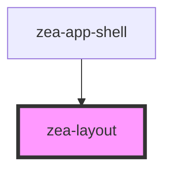

# zea-layout

<!-- Auto Generated Below -->

## Properties

| Property         | Attribute         | Description | Type      | Default        |
| ---------------- | ----------------- | ----------- | --------- | -------------- |
| `cellASize`      | `cell-a-size`     |             | `number`  | `100`          |
| `cellCSize`      | `cell-c-size`     |             | `number`  | `100`          |
| `cellCount`      | `cell-count`      |             | `number`  | `3`            |
| `orientation`    | `orientation`     |             | `string`  | `'horizontal'` |
| `resizeCellA`    | `resize-cell-a`   |             | `boolean` | `true`         |
| `resizeCellC`    | `resize-cell-c`   |             | `boolean` | `true`         |
| `resizeInterval` | `resize-interval` |             | `number`  | `50`           |
| `showBorders`    | `show-borders`    |             | `boolean` | `true`         |

## Dependencies

### Used by

 - [zea-app-shell](../zea-app-shell)

### Graph

----------------------------------------------

*Built with [StencilJS](https://stenciljs.com/)*
