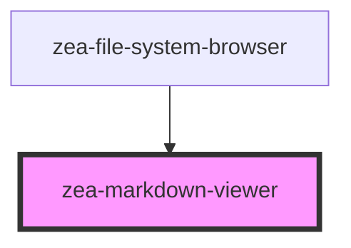

# zea-markdown-viewer

<!-- Auto Generated Below -->

## Properties

| Property | Attribute | Description             | Type     | Default     |
| -------- | --------- | ----------------------- | -------- | ----------- |
| `mdText` | `md-text` | MD text to be converted | `string` | `undefined` |

## Dependencies

### Used by

 - [zea-file-system-browser](../zea-file-system-browser)

### Graph

----------------------------------------------

*Built with [StencilJS](https://stenciljs.com/)*
