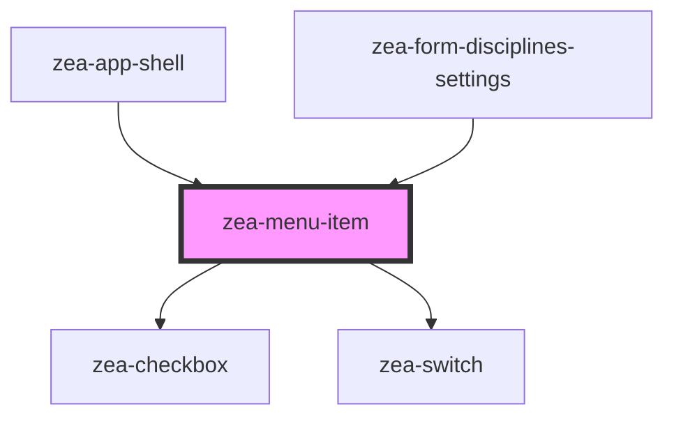

# zea-menu-item

<!-- Auto Generated Below -->

## Properties

| Property      | Attribute      | Description | Type          | Default     |
| ------------- | -------------- | ----------- | ------------- | ----------- |
| `active`      | `active`       |             | `boolean`     | `false`     |
| `allowHover`  | `allow-hover`  |             | `boolean`     | `false`     |
| `callback`    | `callback`     |             | `any`         | `undefined` |
| `checked`     | `checked`      |             | `boolean`     | `false`     |
| `hasCheckbox` | `has-checkbox` |             | `boolean`     | `false`     |
| `hasSubitems` | `has-subitems` |             | `boolean`     | `false`     |
| `hotkey`      | `hotkey`       |             | `string`      | `''`        |
| `rootMenu`    | --             |             | `HTMLElement` | `undefined` |
| `shown`       | `shown`        |             | `boolean`     | `false`     |
| `switch`      | `switch`       |             | `boolean`     | `false`     |
| `type`        | `type`         |             | `string`      | `''`        |

## Events

| Event                | Description                             | Type               |
| -------------------- | --------------------------------------- | ------------------ |
| `zeaMenuItemClick`   | Event to emit when an item gets clicked | `CustomEvent<any>` |
| `zeaMenuItemPressed` | Event to emit when an item gets clicked | `CustomEvent<any>` |

## Dependencies

### Used by

 - [zea-app-shell](../zea-app-shell)
 - [zea-form-disciplines-settings](../zea-form-disciplines-settings)

### Depends on

- [zea-checkbox](../zea-checkbox)
- [zea-switch](../zea-switch)

### Graph

----------------------------------------------

*Built with [StencilJS](https://stenciljs.com/)*
