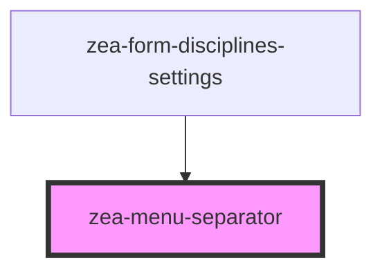

# zea-menu-separator

<!-- Auto Generated Below -->

## Properties

| Property      | Attribute     | Description | Type     | Default        |
| ------------- | ------------- | ----------- | -------- | -------------- |
| `class`       | `class`       |             | `string` | `''`           |
| `orientation` | `orientation` |             | `string` | `'horizontal'` |

## Dependencies

### Used by

 - [zea-form-disciplines-settings](../zea-form-disciplines-settings)

### Graph

----------------------------------------------

*Built with [StencilJS](https://stenciljs.com/)*
