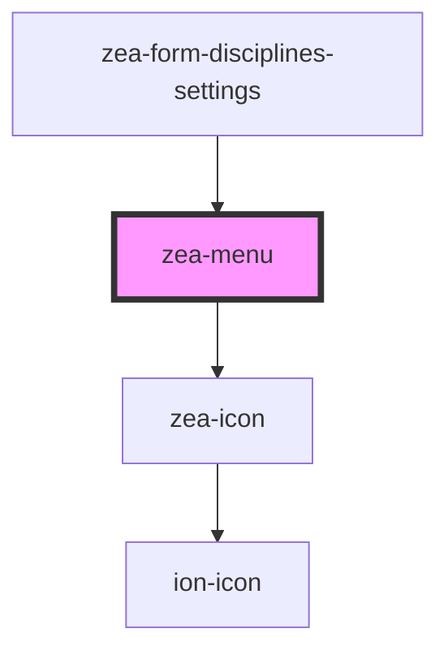

# zea-menu

<!-- Auto Generated Below -->

## Properties

| Property          | Attribute          | Description | Type      | Default                              |
| ----------------- | ------------------ | ----------- | --------- | ------------------------------------ |
| `anchorIcon`      | `anchor-icon`      |             | `string`  | `'ellipsis-vertical-circle-outline'` |
| `contextualAlign` | `contextual-align` |             | `string`  | `'top-left'`                         |
| `leftOffset`      | `left-offset`      |             | `string`  | `''`                                 |
| `showAnchor`      | `show-anchor`      |             | `boolean` | `false`                              |
| `shown`           | `shown`            |             | `boolean` | `false`                              |
| `topOffset`       | `top-offset`       |             | `string`  | `''`                                 |
| `type`            | `type`             |             | `string`  | `'dropdown'`                         |

## Dependencies

### Used by

 - [zea-form-disciplines-settings](../zea-form-disciplines-settings)

### Depends on

- [zea-icon](../zea-icon)

### Graph

----------------------------------------------

*Built with [StencilJS](https://stenciljs.com/)*
