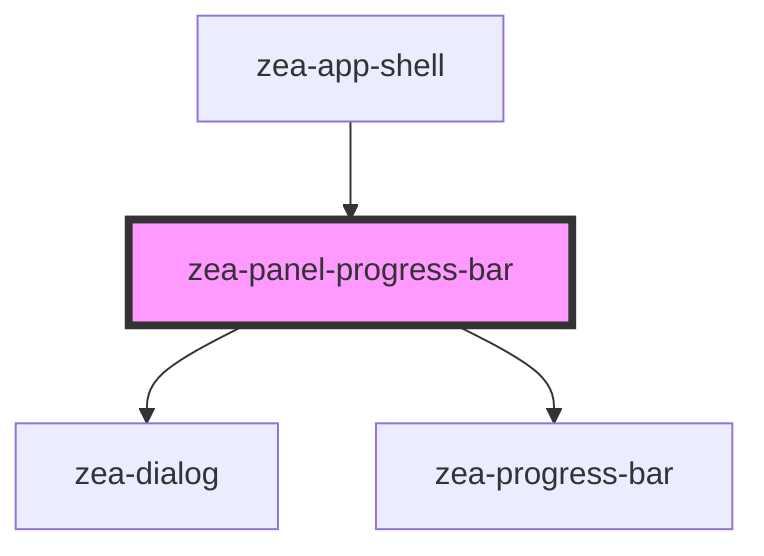

# zea-panel-progress-bar

<!-- Auto Generated Below -->

## Properties

| Property      | Attribute      | Description | Type  | Default     |
| ------------- | -------------- | ----------- | ----- | ----------- |
| `progressBar` | `progress-bar` |             | `any` | `undefined` |

## Dependencies

### Used by

 - [zea-app-shell](../zea-app-shell)

### Depends on

- [zea-dialog](../zea-dialog)
- [zea-progress-bar](../zea-progress-bar)

### Graph

----------------------------------------------

*Built with [StencilJS](https://stenciljs.com/)*
