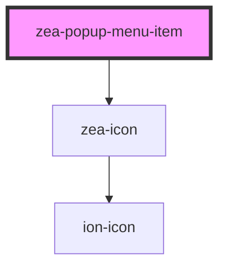

# zea-popup-menu-item

<!-- Auto Generated Below -->

## Properties

| Property       | Attribute    | Description                       | Type               | Default     |
| -------------- | ------------ | --------------------------------- | ------------------ | ----------- |
| `clickHandler` | --           | Click Handler                     | `CallableFunction` | `undefined` |
| `endIcon`      | `end-icon`   | Material icon name for item end   | `string`           | `undefined` |
| `startIcon`    | `start-icon` | Material icon name for item start | `string`           | `undefined` |

## Dependencies

### Depends on

- [zea-icon](../zea-icon)

### Graph

----------------------------------------------

*Built with [StencilJS](https://stenciljs.com/)*
