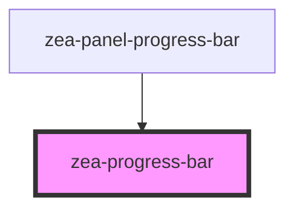

# zea-progress-bar

<!-- Auto Generated Below -->

## Properties

| Property                 | Attribute                 | Description                                                             | Type     | Default                    |
| ------------------------ | ------------------------- | ----------------------------------------------------------------------- | -------- | -------------------------- |
| `backgroundColor`        | `background-color`        | The color for the background track                                      | `any`    | `'var(--color-primary-3)'` |
| `color`                  | `color`                   | The color for the bar                                                   | `any`    | `'var(--color-primary-1)'` |
| `indeterminateAnimation` | `indeterminate-animation` | The animation type for the indeterminate bar ( continuous \| pulsating) | `any`    | `'continuous'`             |
| `percent`                | `percent`                 | The progress (width) percentage for the bar                             | `any`    | `50`                       |
| `size`                   | `size`                    | The size (height) of the progress bar                                   | `any`    | `3`                        |
| `type`                   | `type`                    | The bar type (determinate \| indeterminate)                             | `string` | `'determinate'`            |

## Dependencies

### Used by

 - [zea-panel-progress-bar](../zea-panel-progress-bar)

### Graph

----------------------------------------------

*Built with [StencilJS](https://stenciljs.com/)*
