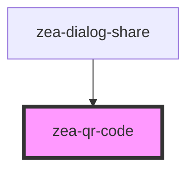

# zea-qr-code

<!-- Auto Generated Below -->

## Properties

| Property  | Attribute | Description                     | Type     | Default                |
| --------- | --------- | ------------------------------- | -------- | ---------------------- |
| `content` | `content` | The content to code into the QR | `string` | `window.location.href` |
| `scale`   | `scale`   | The content to code into the QR | `number` | `4`                    |

## Dependencies

### Used by

 - [zea-dialog-share](../zea-dialog-share)

### Graph

----------------------------------------------

*Built with [StencilJS](https://stenciljs.com/)*
