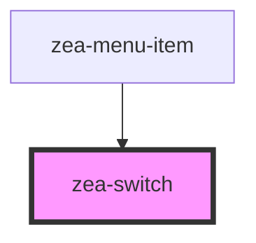

# zea-switch

<!-- Auto Generated Below -->

## Properties

| Property     | Attribute     | Description                                 | Type      | Default     |
| ------------ | ------------- | ------------------------------------------- | --------- | ----------- |
| `checked`    | `checked`     | Whether the switch is checked               | `boolean` | `false`     |
| `disabled`   | `disabled`    | Whether the switch is disabled              | `boolean` | `false`     |
| `name`       | `name`        | Text/html to be displayed inside the button | `string`  | `undefined` |
| `stateLabel` | `state-label` | State label to show next to the switch      | `string`  | `undefined` |

## Dependencies

### Used by

 - [zea-menu-item](../zea-menu-item)

### Graph

----------------------------------------------

*Built with [StencilJS](https://stenciljs.com/)*
