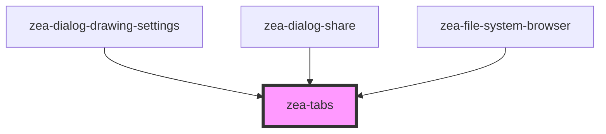

# zea-tabs

<!-- Auto Generated Below -->

## Properties

| Property      | Attribute     | Description | Type     | Default        |
| ------------- | ------------- | ----------- | -------- | -------------- |
| `density`     | `density`     |             | `string` | `'medium'`     |
| `orientation` | `orientation` |             | `string` | `'horizontal'` |

## Dependencies

### Used by

 - [zea-dialog-drawing-settings](../zea-dialog-drawing-settings)
 - [zea-dialog-share](../zea-dialog-share)
 - [zea-file-system-browser](../zea-file-system-browser)

### Graph

----------------------------------------------

*Built with [StencilJS](https://stenciljs.com/)*
