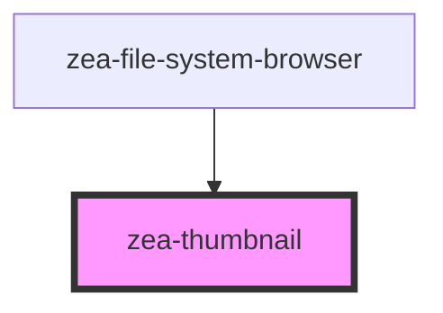

# zea-thumbnail

<!-- Auto Generated Below -->

## Properties

| Property           | Attribute            | Description                          | Type  | Default     |
| ------------------ | -------------------- | ------------------------------------ | ----- | ----------- |
| `icon`             | `icon`               |                                      | `any` | `undefined` |
| `zeaModelInstance` | `zea-model-instance` | The Zea model instance to represent. | `any` | `undefined` |
| `zeaSession`       | `zea-session`        |                                      | `any` | `undefined` |

## Events

| Event               | Description | Type               |
| ------------------- | ----------- | ------------------ |
| `clickThumbnail`    |             | `CustomEvent<any>` |
| `dblClickThumbnail` |             | `CustomEvent<any>` |

## Dependencies

### Used by

 - [zea-file-system-browser](../zea-file-system-browser)

### Graph

----------------------------------------------

*Built with [StencilJS](https://stenciljs.com/)*
