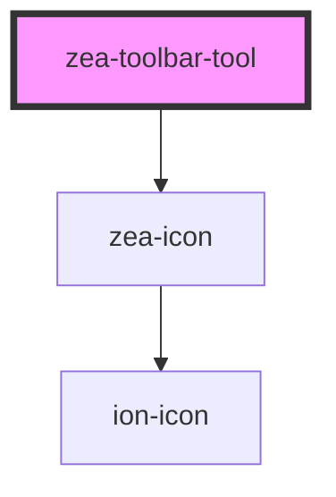

# zea-toolbar-tool

<!-- Auto Generated Below -->

## Properties

| Property   | Attribute   | Description                          | Type      | Default     |
| ---------- | ----------- | ------------------------------------ | --------- | ----------- |
| `data`     | `data`      | The tool data                        | `any`     | `undefined` |
| `isActive` | `is-active` | Whether the tool is currently active | `boolean` | `undefined` |

## Events

| Event                 | Description                               | Type               |
| --------------------- | ----------------------------------------- | ------------------ |
| `zeaToolbarToolClick` | Event to emit when user chip gets clicked | `CustomEvent<any>` |

## Dependencies

### Depends on

- [zea-icon](../zea-icon)

### Graph

----------------------------------------------

*Built with [StencilJS](https://stenciljs.com/)*
