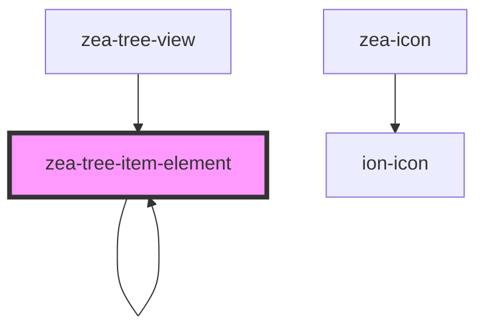

# zea-tree-item-element

<!-- Auto Generated Below -->

## Properties

| Property        | Attribute        | Description | Type      | Default        |
| --------------- | ---------------- | ----------- | --------- | -------------- |
| `appData`       | `app-data`       |             | `any`     | `undefined`    |
| `isExpanded`    | `is-expanded`    |             | `boolean` | `false`        |
| `isHighlighted` | `is-highlighted` |             | `boolean` | `false`        |
| `isRoot`        | `is-root`        |             | `boolean` | `false`        |
| `isSelected`    | `is-selected`    |             | `boolean` | `false`        |
| `isTreeItem`    | `is-tree-item`   |             | `boolean` | `false`        |
| `isVisible`     | `is-visible`     |             | `boolean` | `false`        |
| `itemContainer` | `item-container` |             | `any`     | `undefined`    |
| `label`         | `label`          |             | `string`  | `'Loading...'` |
| `treeItem`      | `tree-item`      |             | `any`     | `undefined`    |

## Dependencies

### Used by

 - [zea-tree-item-element](.)
 - [zea-tree-view](../zea-tree-view)

### Depends on

- [zea-icon](../zea-icon)
- [zea-tree-item-element](.)

### Graph

----------------------------------------------

*Built with [StencilJS](https://stenciljs.com/)*
