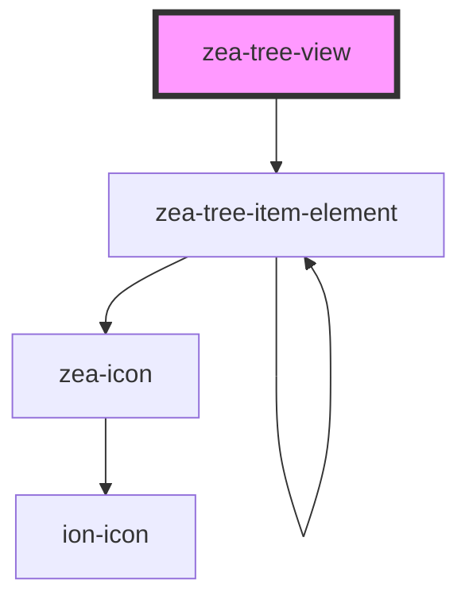

# zea-tree-view

<!-- Auto Generated Below -->

## Properties

| Property   | Attribute   | Description | Type  | Default     |
| ---------- | ----------- | ----------- | ----- | ----------- |
| `appData`  | `app-data`  |             | `any` | `undefined` |
| `rootItem` | `root-item` |             | `any` | `undefined` |

## Dependencies

### Depends on

- [zea-tree-item-element](../zea-tree-item-element)

### Graph

----------------------------------------------

*Built with [StencilJS](https://stenciljs.com/)*
