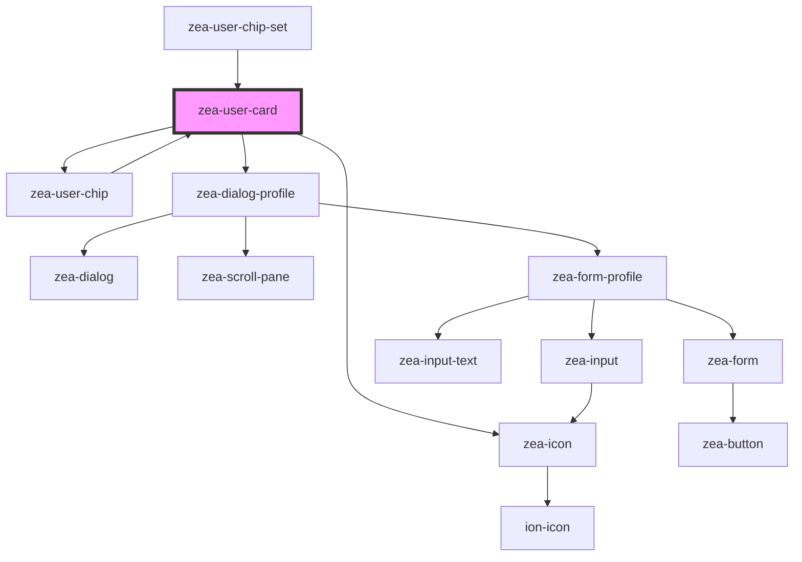

# zea-user-card

<!-- Auto Generated Below -->

## Properties

| Property              | Attribute               | Description                                              | Type      | Default     |
| --------------------- | ----------------------- | -------------------------------------------------------- | --------- | ----------- |
| `additionalDataShown` | `additional-data-shown` | Whether additional data is currently shown               | `boolean` | `undefined` |
| `collapsible`         | `collapsible`           | Whether to show the collpase control for additional data | `boolean` | `true`      |
| `density`             | `density`               | Density and size of elements                             | `string`  | `'normal'`  |
| `isCurrentUser`       | `is-current-user`       | Whether the card is for the current user session         | `boolean` | `false`     |
| `userData`            | `user-data`             |                                                          | `any`     | `undefined` |

## Dependencies

### Used by

 - [zea-user-chip](../zea-user-chip)
 - [zea-user-chip-set](../zea-user-chip-set)

### Depends on

- [zea-user-chip](../zea-user-chip)
- [zea-icon](../zea-icon)
- [zea-dialog-profile](../zea-dialog-profile)

### Graph

----------------------------------------------

*Built with [StencilJS](https://stenciljs.com/)*
