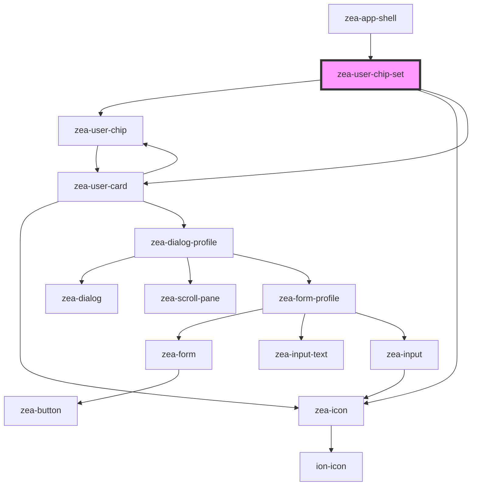

# zea-chip-set

<!-- Auto Generated Below -->

## Properties

| Property        | Attribute         | Description                                     | Type      | Default     |
| --------------- | ----------------- | ----------------------------------------------- | --------- | ----------- |
| `initialZIndex` | `initial-z-index` | The initial z-index for chip overlapping        | `number`  | `1000`      |
| `overflowLimit` | `overflow-limit`  | Number of chips to show before overflow happens | `any`     | `5`         |
| `session`       | `session`         | The Zea session                                 | `any`     | `undefined` |
| `showImages`    | `show-images`     | Whether avatar images should be shown or not    | `boolean` | `true`      |

## Dependencies

### Used by

 - [zea-app-shell](../zea-app-shell)

### Depends on

- [zea-user-chip](../zea-user-chip)
- [zea-icon](../zea-icon)
- [zea-user-card](../zea-user-card)

### Graph

----------------------------------------------

*Built with [StencilJS](https://stenciljs.com/)*
