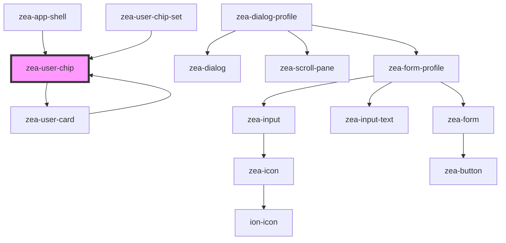

# zea-chip

<!-- Auto Generated Below -->

## Properties

| Property           | Attribute            | Description                                                       | Type      | Default     |
| ------------------ | -------------------- | ----------------------------------------------------------------- | --------- | ----------- |
| `density`          | `density`            | The density of the chip (large\|normal\|small\|tiny)              | `string`  | `'normal'`  |
| `isActive`         | `is-active`          | Whether the chip is currently active                              | `boolean` | `false`     |
| `isCurrentUser`    | `is-current-user`    | Whether the chip is for the current user session                  | `boolean` | `false`     |
| `profileCardAlign` | `profile-card-align` | Alignment of the profile card (right\|left)                       | `string`  | `'left'`    |
| `profileCardShown` | `profile-card-shown` | Whether the profile card is currently shown                       | `boolean` | `false`     |
| `showImages`       | `show-images`        | Whether avatar images should be shown or not                      | `boolean` | `true`      |
| `showProfileCard`  | `show-profile-card`  | Whether to ever show the profile card                             | `boolean` | `true`      |
| `showTooltip`      | `show-tooltip`       | Whether the tooltip should be shown                               | `boolean` | `true`      |
| `userData`         | `user-data`          | User object containing avatar url, firstName, lastName and others | `any`     | `undefined` |

## Events

| Event            | Description                               | Type               |
| ---------------- | ----------------------------------------- | ------------------ |
| `zeaUserClicked` | Event to emit when user chip gets clicked | `CustomEvent<any>` |

## Dependencies

### Used by

 - [zea-app-shell](../zea-app-shell)
 - [zea-user-card](../zea-user-card)
 - [zea-user-chip-set](../zea-user-chip-set)

### Depends on

- [zea-user-card](../zea-user-card)

### Graph

----------------------------------------------

*Built with [StencilJS](https://stenciljs.com/)*
